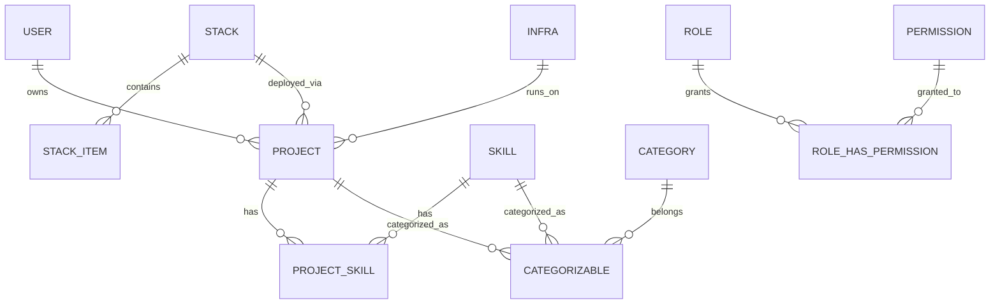

<div align="center">

# 🎨 Sena Studio

### Personal Freelance Tracker & Public Portfolio Backend

>A comprehensive project management and portfolio platform built on **Laravel 13**, **Filament v5**, and **Livewire/Flux** — empowering freelancers to track projects, manage technology stacks, catalog skills, and provision infrastructure with enterprise-grade elegance.

[](https://laravel.com)
[](https://www.php.net)
[](https://filamentphp.com)
[](https://livewire.laravel.com)
[](https://fluxui.dev)
[](LICENSE)

**Author:** Sena Gedeon D'ALMEIDA — [email](mailto:senadalmeidapro@gmail.com)

</div>

---

## 📖 Overview

**Sena Studio** is a personal freelance business command center. It unifies project tracking, technology cataloging, skill management, and infrastructure provisioning into a single, beautifully crafted admin interface — backed by a robust and extendable architecture.

Whether you are managing a single client project, documenting your tech arsenal, or preparing your public portfolio, Sena Studio gives you the structure to work with clarity and professionalism.

---

## ✨ Features

### 🗂️ Project Management
- Rich project metadata: **status**, **type**, **complexity**, **visibility**, and pricing
- Associate projects with technology **stacks** and **infrastructure**
- Attach **skills** with context-specific proficiency levels (`primary` / `secondary` / `research`)
- Classify projects under polymorphic **categories**
- Soft deletes & advanced filtering

### 🧩 Technology Stacks
- Define named stacks as reusable collections of tools (e.g., *"Laravel + PostgreSQL + Redis"*)
- Every item categorized: **frontend, backend, database, cache, queue, ORM, storage, cloud, monitoring, analytics, devops, design, testing, documentation, others**
- Inline repeater editing inside the Filament admin

### 🛠️ Skills Catalog
- Skills with expertise levels: `beginner` → `intermediate` → `advanced` → `expert`
- Visual **icons** and **activation** toggles
- Categorize skills with the shared polymorphic category system

### ☁️ Infrastructure as Data
- Define infrastructure records with **Docker**, **Kubernetes**, and **Helm** configurations
- Specify resource allocations: **CPU cores**, **memory (MB)**, **storage (GB)**
- Classify environments: `development`, `staging`, `production`

### 🔐 Authentication & Security
- **Fortify**-powered auth: registration, password reset, **email verification**, and **two-factor authentication** (2FA)
- Custom **Livewire/Flux** auth & settings views
- **Spatie RBAC**: fine-grained roles & permissions
- Production-hardened password policy enforcement

### 📊 Insights Dashboard
- KPI stats: users, projects, skills, stacks, active projects, infrastructure
- **Bar charts**: skills by category & project stack distribution
- Infrastructure health: environment breakdown, provisioned CPU/memory/storage
- Quick-action shortcuts for rapid data entry

### 🧑‍💻 Developer-First Architecture
- **Enum-driven** type safety across all state fields
- Clean **Resource → Form/Table/Page** decomposition in Filament
- 9 Eloquent domain models with thoughtfully designed relationships
- 6 factories + Seeder for rapid local development
- **Pest** testing suite ready to expand

---

## 🛠️ Technology Stack

| Layer | Technology |
|---|---|
| **Runtime** | PHP 8.3 |
| **Framework** | Laravel 13 |
| **Admin Panel** | Filament v5 |
| **Frontend** | Livewire 4 · Flux 2 · Tailwind CSS 4 · Vite 8 |
| **Database** | SQLite (dev) · MySQL/PostgreSQL ready |
| **Auth** | Fortify · Sanctum |
| **Billing** | Cashier (Stripe) |
| **RBAC** | Spatie Permission |
| **Media** | Spatie MediaLibrary |
| **Testing** | Pest |

---

## 🚀 Getting Started

### Prerequisites

- **PHP** >= 8.3
- **Composer** 2.x
- **Node.js** 18+ & **npm**
- SQLite (default) or a MySQL/PostgreSQL database

### Installation

Clone the repository and install dependencies:

```bash
git clone https://github.com/sena/sena-studio.git
cd sena-studio

composer install
```

Copy the environment file and generate your application key:

```bash
cp .env.example .env
php artisan key:generate
```

> **Windows:** use `copy .env.example .env` instead of `cp`.

Configure your database in `.env`. SQLite works out of the box:

```
DB_CONNECTION=sqlite
```

Create the SQLite database (see note below) and run migrations with seeders:

```bash
php artisan migrate --seed
```

Install the frontend assets:

```bash
npm install
npm run build
```

### Bootstrap Command

Prefer a one-liner? Run the composer setup script which handles everything:

```bash
composer setup
```

---

## ▶️ Running the Development Environment

The project ships with a concurrent dev server that runs **all** four processes simultaneously (server, queue, logs, vite) with color-coded output:

```bash
composer dev
```

| Process | Command |
|---|---|
| **HTTP Server** | `php artisan serve` |
| **Queue Worker** | `php artisan queue:listen` |
| **Logs (Pail)** | `php artisan pail` |
| **Asset Bundler** | `npm run dev` |

Alternatively, run services individually:

```bash
php artisan serve        # Web server (http://localhost:8000)
npm run dev              # Vite dev server (hot reload)
php artisan queue:listen # Queue worker (background jobs)
php artisan pail         # Real-time log streaming
```

---

## 🔑 Access & Credentials

The seed command creates an **admin user** for immediate access:

| Role | Email |
|---|---|
| **Administrator** | `senadalmeidapro@gmail.com` |

> ⚠️ The default seeded password is set by the `DatabaseSeeder`. Change it after your first login.

### Key URL Entry Points

| Route | Description |
|---|---|
| `/admin` | Filament admin panel (login protected) |
| `/dashboard` | Authenticated & verified user dashboard |
| `/settings` | Profile, appearance & security settings |
| `/` | Public welcome page |

---

## 📁 Project Structure

```
sena-studio/
│
├── app/
│   ├── Actions/          # Fortify actions (CreateNewUser, ResetUserPassword)
│   ├── Concerns/         # Shared traits (Password & Profile validation rules)
│   ├── Enums/            # 7 typed backed enums (Project, Skill, Stack, Infra)
│   ├── Filament/
│   │   ├── Pages/        # Custom dashboard page
│   │   ├── Resources/    # 8 CRUD resources
│   │   └── Widgets/      # 5 dashboard widgets (stats + charts)
│   ├── Http/             # Controllers
│   ├── Livewire/         # Livewire components (Logout action)
│   ├── Models/           # 9 Eloquent domain models
│   └── Providers/        # App, AdminPanel, Fortify service providers
│
├── config/               # Application configuration
├── database/
│   ├── factories/        # 6 model factories
│   ├── migrations/       # Schema migrations
│   └── seeders/          # DatabaseSeeder
│
├── resources/
│   ├── css/              # Global styles (Tailwind)
│   ├── js/               # Bootstrap JS
│   └── views/            # Blade + Flux views (auth, settings, layouts)
│
├── routes/
│   ├── console.php       # Artisan commands
│   ├── settings.php      # Settings routes
│   └── web.php           # Web routes
│
├── tests/                # Pest test suites
└── vite.config.js        # Vite + Tailwind configuration
```

---

## 🗃️ Data Model

### Relationships



### Core Entities

| Entity | Purpose |
|---|---|
| `Project` | Core unit — links stacks, skills, infrastructure, categories |
| `Stack` | Named technology collection decomposed into categorized `StackItems` |
| `Skill` | Expertise catalog with levels & icons |
| `Infra` | Infrastructure definitions (Docker, K8s, resource specs) |
| `Category` | Polymorphic classification for Projects & Skills |
| `User` | Account holder with 2FA & role assignments |

---

## ✔️ Code Quality

Run the linter (Pint) and the test suite with a single command:

```bash
composer test
```

Or individually:

```bash
composer lint        # Fix code style automatically
composer lint:check  # Verify code style only
php artisan test     # Run the Pest test suite
```

The CI check runs the complete pipeline (`config:clear` → `lint:check` → `test`):

```bash
composer ci:check
```

---

## 🧪 Testing

The project is pre-configured with **Pest** and an isolated `:memory:` SQLite database, so tests run fast and clean without touching your development data.

```bash
# Run all tests
php artisan test

# Run a specific file
php artisan test --filter=ProjectTest
```

---

## 🌍 Production Hardening

Built-in safety guards for production deployments:

- **Strict password policy** enforced (`min 12 chars`, mixed case, symbols, uncompromised)
- **Critical destructive commands blocked** in the `production` environment
- **CarbonImmutable** set globally for consistent, immutable date handling
- **Fortify rate-limiting** on authentication endpoints (5/min)
- **2FA** available for accounts

---

## 🤝 Contributing

Contributions are welcome! Please ensure a clean codebase:

1. Fork the repository
2. Create your feature branch (`git checkout -b feature/amazing-feature`)
3. Commit your changes (`git commit -m 'feat: add amazing feature'`)
4. Push to the branch (`git push origin feature/amazing-feature`)
5. Run `composer lint` and `composer test` before opening a PR
6. Open a Pull Request

---

## 📄 License

Released under the [MIT license](LICENSE).

---

<div align="center">

**Built with ❤️ by [Sena Gedeon D'ALMEIDA](mailto:senadalmeidapro@gmail.com)**

</div>